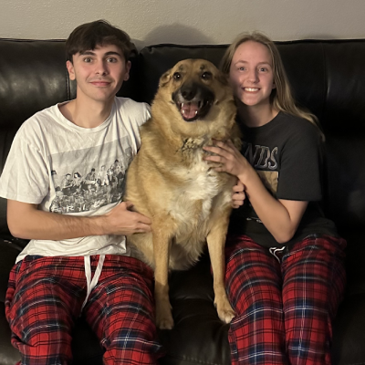

####  Owen Coombs Blog
##### _Posted March 8th 2024_

##  Was your first week what you expected? Why? Why not?
####  I really didnt know what to expext besides general onboarding, I expected going over stuff like Github, and VScode but wasn't really sure on what to expect for the rest.
## What are you excited or eager to learn more about?
####  I am really excited to create larger project and to work more as a team on some project! I am also excited to learn more about css and styling! 
##   What is something about you that can only be learned by reading this blog?
- I am a really big fan of basketball, ive played my whole life.
- I love to watch Anime, currently my favorite anime to watch right now is "Jujutsu Kaisen".
- Ive been with my girlfriend Maddie for the past 7 years and weve had our Oakley for 2 years now!
# Week 2
- ## What is something you wish you could do but currently do not have the coding skills to accomplish?
    I would like to under stand float and flex a little bit better along with working more with forms.
- ## What are you struggling with?
    Float and Flex, I need to look more into how it works.
- ## How do you solve a problem? 
    if i cant wrap my brain around it, ill ask a question or look at other peoples code to see if i can recreate it.
- ## What methods do you use to help yourself get unstuck?
    I like to take a step back and take a second to calm down and take a break.